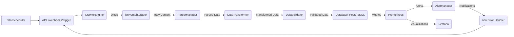

# Intelligent Data Acquisition Platform - Architecture Design

## 1. Introduction

This document outlines the architectural design of the Intelligent Data Acquisition Platform. It details the various layers, components, their responsibilities, and how they interact to achieve the platform's goal of automated web scraping and data acquisition.

## 2. High-Level Architecture

The platform follows a layered, modular architecture, promoting separation of concerns and scalability.

```mermaid
graph TD
    A[External Triggers / Scheduler (n8n)] --> B(API Layer)
    B --> C(Discovery Layer - Crawler)
    C --> D(Extraction Layer - Scrapers)
    D --> E(Parsing Layer - Parsers)
    E --> F(Transformation Layer)
    F --> G(Validation Layer)
    G --> H(Storage Layer - PostgreSQL)
    H --> B
    B --> I(Monitoring Layer - Prometheus)
    I --> J(Monitoring Layer - Grafana)
    J --> B
```

## 3. Detailed Component Breakdown

### 3.1. Discovery Layer (Crawler)
-   **Component:** `CrawlerEngine`
-   **Responsibility:** Auto-discovers URLs from seed URLs, supports BFS/DFS, respects `robots.txt` and rate limits, filters URLs.
-   **Key Modules:** `crawler_engine.py`, `url_filter.py`

### 3.2. Extraction Layer (Scraper Templates)
-   **Component:** `UniversalScraper`, `HTMLScraper`, `SPAScraper`, `APIScraper`, `PDFScraper`, `ExcelScraper`
-   **Responsibility:** Fetches raw content from various types of websites (HTML, SPA, API, PDF, Excel). Each concrete scraper implements `extract()`, `validate()`, and `run()`.
-   **Key Modules:** `base_scraper.py`, `universal_scraper.py`, `html_scraper.py`, `spa_scraper.py` (others to be implemented)

### 3.3. Parsing Layer
-   **Component:** `ParserManager`, `CSSParser`, `XPathParser`, `AIParser` (using Gemini API), `JSONParser`
-   **Responsibility:** Extracts structured data from raw content. `ParserManager` auto-selects the appropriate parser based on configuration.
-   **Key Modules:** `parser_manager.py`, `css_parser.py`, `xpath_parser.py`, `ai_parser.py` (JSONParser to be implemented)

### 3.4. Transformation Layer
-   **Component:** `DataTransformer`
-   **Responsibility:** Applies field mapping, data cleaning, normalization, and type conversion to parsed data.
-   **Key Modules:** `data_transformer.py`

### 3.5. Validation Layer
-   **Component:** `DataValidator`
-   **Responsibility:** Ensures data quality by applying rule-based validation checks.
-   **Key Modules:** `data_validator.py`

### 3.6. Storage Layer
-   **Component:** PostgreSQL, Redis, SQLAlchemy ORM
-   **Responsibility:** Persists structured data (PostgreSQL), handles caching and queues (Redis). SQLAlchemy ORM provides an abstraction for database interactions.
-   **Key Modules:** `database/schema.sql`, `database/connection.py`

### 3.7. API Layer
-   **Component:** FastAPI
-   **Responsibility:** Provides RESTful endpoints for data access, site management, and webhook integration.
-   **Key Modules:** `api/main.py`, `api/routers/data.py`, `api/routers/webhooks.py`, `api/schemas.py`

### 3.8. Monitoring Layer
-   **Component:** Prometheus, Grafana, Exporters (Node, Postgres, Redis)
-   **Responsibility:** Collects metrics from all services, visualizes them in dashboards, and configures alerts for failures.
-   **Key Modules:** `monitoring/prometheus/prometheus.yml`, `monitoring/prometheus/alert.rules.yml`, `monitoring/grafana/*.json`, `api/metrics.py`

### 3.9. Orchestration Layer (n8n)
-   **Component:** n8n
-   **Responsibility:** Automates workflows for scheduled scraping, error handling, data quality checks, and notifications.
-   **Key Modules:** `n8n_workflows/*.json`

## 4. Data Flow

1.  **Trigger:** An n8n workflow (e.g., daily schedule) triggers a scraping job via the API's webhook (`POST /api/v1/webhooks/trigger/{site_name}`).
2.  **Crawl:** The `CrawlerEngine` starts from seed URLs, discovers new URLs, respecting `robots.txt` and rate limits.
3.  **Extract:** For each discovered URL, the `UniversalScraper` selects the appropriate scraper template (HTML, SPA, etc.) which then `extracts` the raw content.
4.  **Parse:** The raw content is passed to the `ParserManager`, which selects and executes the correct parser (CSS, XPath, AI using Gemini API) to extract structured data.
5.  **Transform:** The extracted data is then passed to the `DataTransformer` for field mapping, cleaning, and type conversion.
6.  **Validate:** The transformed data is sent to the `DataValidator` to ensure data quality against predefined rules.
7.  **Store:** Validated data is then batch-inserted into the PostgreSQL database via SQLAlchemy ORM, with change detection using data hashing.
8.  **Monitoring:** Throughout the process, services expose metrics to Prometheus, which are visualized in Grafana. Alerts are triggered on failures.
9.  **Error Handling:** If any step fails, an n8n error handler workflow can be triggered via a webhook to retry the job or send notifications.



## 5. Deployment Architecture

The entire platform is deployed using Docker Compose, orchestrating multiple services in a containerized environment.

```mermaid
graph TD
    User --> Nginx
    Nginx --> API
    Nginx --> Grafana
    Nginx --> n8n

    API --> PostgreSQL
    API --> Redis
    API --> Gemini API (External)
# ...
    subgraph Docker Compose
        API
        PostgreSQL
        Redis
        n8n
        Prometheus
        Grafana
        Nginx
        NodeExporter
        PostgresExporter
        RedisExporter
    end
```

## 6. Future Enhancements

-   Implement `APIScraper`, `PDFScraper`, `ExcelScraper`, and `JSONParser`.
-   Develop a more sophisticated site management system within the API.
-   Implement user authentication and authorization for the API.
-   Expand data quality rules and integrate with the `data_quality_issues` table.
-   Implement a queueing system (e.g., Redis queues) for asynchronous scraping jobs.
-   Add more detailed monitoring metrics and Grafana dashboards.
-   Develop a CI/CD pipeline for automated testing and deployment.
